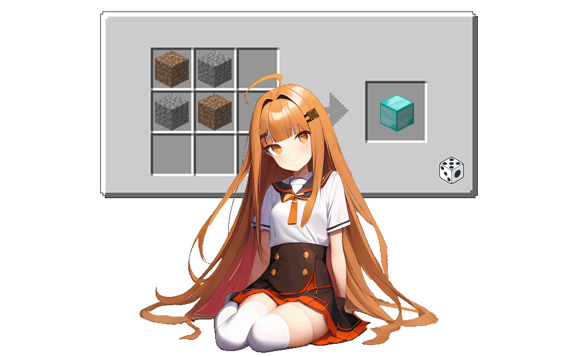

# Random Crafting

All recipes are messed up by this mod. You may be able to get a stick from an iron block or get a netherite ingot from three cobblestones. Can you still beat the game?
## Usage:

Put the .jar file under the `mods` folder and run the game. 

Edit `config/randomcrafting-common.toml` and `randomcrafting-server.toml` if desired.

In the game, type `/rc reshuffle` to randomize all your craft recipes! 

Feel free to type `/rc revoke` when you want to revert the changes.

## Copyright
This mod is open-sourced under the LGPL license.

The logo is licensed under CC-BY-NC-ND 4.0.

